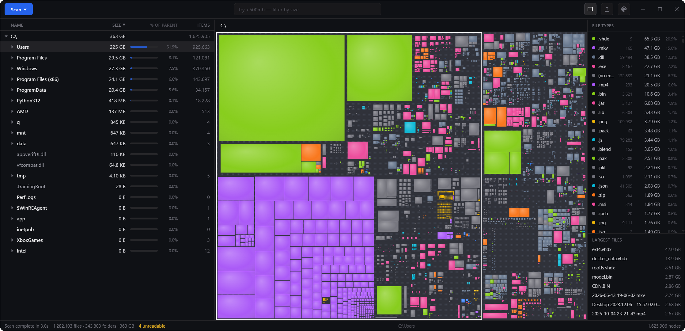

# mathom

A fast disk space analyzer for Windows. Scan a drive, see where the space
went, clean it up: live tree, zoomable treemap, file-type breakdown, search,
and delete to the Recycle Bin.



**Status: alpha.** Scanning and the UI work end to end, but expect rough
edges and breaking changes between releases. Windows only for now; the core
crates build on Linux and macOS by design, there just is no UI for them yet.


## Why another one

On NTFS volumes mathom reads the Master File Table directly instead of
walking folders, and scans faster than WizTree in local tests. Results
stream in while the scan runs, so the tree and treemap fill in live
instead of appearing at the end.

It also tries hard to report sizes truthfully: logical vs. allocated size,
NTFS compression, sparse files, hardlinks counted once, and OneDrive
placeholders that claim gigabytes while occupying almost nothing on disk.

## Install

Download the installer (MSI or setup.exe) or the portable zip from
[Releases](../../releases). The app needs the WebView2 runtime, which ships
with Windows 10/11.

The installers are not code-signed yet, so SmartScreen will warn on first
run: "More info", then "Run anyway".

Reading the MFT requires administrator rights; mathom asks once at launch.
If you decline, it falls back to the slower folder walker.

## Build from source

Prerequisites: [Rust](https://rustup.rs) (stable, MSVC) and
[Node.js](https://nodejs.org) 20+.

```text
cd ui && npm ci && cd ..
npm run dev          # development app with hot reload
npm run build:app    # release build + installers
cargo test --workspace
```

## Layout

A cargo workspace. `crates/core` has the tree model, treemap layout, and
search, with no platform-specific code. `crates/scanner` is the generic
parallel walker. `crates/scanner-ntfs` is the raw MFT reader, Windows-only
behind a cargo feature. `src-tauri` and `ui/` are the Tauri v2 shell and the
React front end. Both scan backends implement the same `Scanner` trait; per
scan the app picks the MFT path when the volume is NTFS and the process is
elevated, otherwise the walker.

There is no telemetry.

## Name

A mathom is what hobbits call a thing they have no use for but can't bring
themselves to throw away. Disks are full of them.

## License

[MIT](LICENSE)
